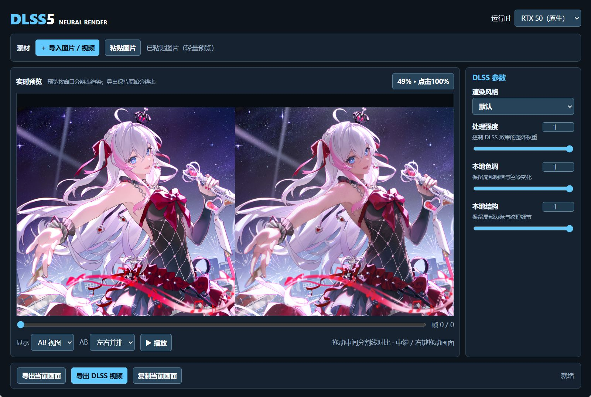

# DLSS5 Neural Render

基于 Rust + Tauri v2 的 DLSS Neural Rendering 桌面预览与导出工具。

## 界面预览



## 构建

```powershell
cargo build --release --manifest-path src-tauri\Cargo.toml
```

构建后的程序位于 `src-tauri\target\release\dlss5-tauri.exe`。

直接双击项目根目录中的 `run.bat` 即可启动；如果 release 程序尚未构建，脚本会
自动执行上述 Cargo 构建。启动脚本只使用 ASCII 字符，兼容旧版 Windows
PowerShell / CMD 的代码页，并会自动固定工作目录，确保程序能够找到宿主 DLL 和
选中的 RTX 运行时。

## 内置运行时

- `nvngx_dlssnr.dll`：RTX 50 原生运行时
- `nvngx_dlssnr_40.dll`：RTX 40 兼容运行时
- `nvngx_dlssnr_30.dll`：RTX 30 兼容运行时

请在第一次进行 DLSS 预览前选择运行时。NGX 会话按进程创建，因此预览开始后切换
运行时需要重启应用。如果兼容 DLL 不被当前驱动或 GPU 接受，程序会记录具体的
原生错误，而不会静默失败。

## 交互说明

- 可以通过“导入图片 / 视频”、拖放或剪贴板载入素材。
- 支持 PNG、JPG、GIF、MP4、AVI、MOV、MKV 等格式；GIF 导入时会自动烘焙为 MP4
  缓存到程序目录的 `Temp` 文件夹，之后按视频轨逐帧预览、播放和导出。
- 视频预览使用常驻的顺序解码器和最近帧缓存；播放来不及处理时会主动跳帧追赶时间线，
  不再为每一帧重复启动 FFmpeg。所有 FFmpeg / FFprobe 子进程均在后台静默运行。
- 轻量预览最长边限制为 1280 像素，以控制内存占用并保持交互流畅；普通图片和视频
  导出仍按原始分辨率处理。
- 可以切换原图、DLSS、对比和 AB 视图。对比视图左侧显示原图、右侧显示 DLSS，
  中间的简洁分割线可直接拖动。
- AB 视图将视窗平均分成两侧，两边显示原图和 DLSS，并同步缩放与位移；滚轮缩放
  会以鼠标所在位置为锚点。
- 使用鼠标中键或右键拖动画面；滑块和数字输入框都可以精确调整参数。

## 导出

选择目标路径后，可以导出当前视图画面，或按素材类型导出 DLSS 图片 / 视频。

视频与 GIF 的解码以及视频编码依赖系统 PATH 中可用的 FFmpeg / FFprobe。
程序启动时会清理上次遗留的 `Temp`，正常关闭时也会删除本次临时缓存。
